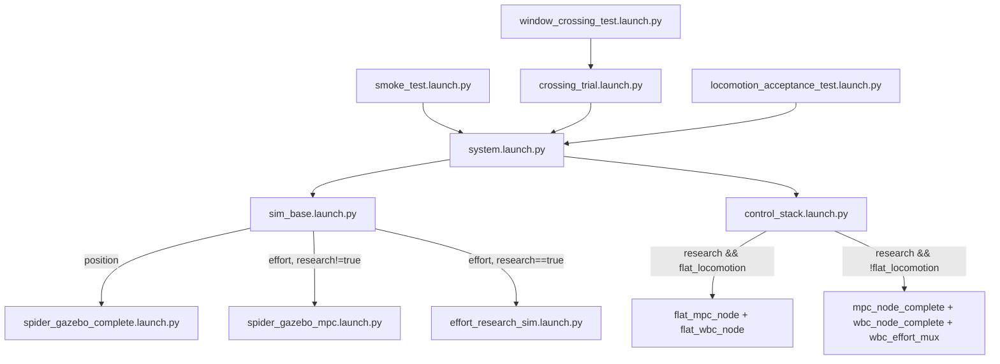
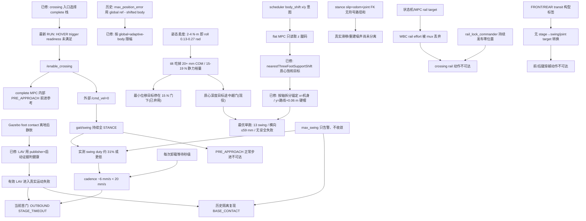

# Dog2 全运动栈分层代码审计（2026-07-11 全量复核）

> 审计对象：**当前工作树快照**（含未提交改动），非 `HEAD` 基线。凡与
> `git HEAD` 或历史文档结论不一致处，本文以当前源码为准并显式标注漂移。
> 首轮审计后已分批闭合原 P0 #1/#2/#3；随后完成九层全量复核、flat 定量归因、
> global/local reference 限幅修复及 body-shift 目标/锚定契约（六跑证据链）。
> 本文状态、§12 台账和 §13 依赖顺序以
> **2026-07-11 19:11 当前工作树与运行结果**为准。

## 0. 目的、范围与约定

### 0.1 目的
从机械/仿真最底层向任务验收层逐层回答三个问题：这一层**应该**满足什么契约、
**当前实际**是什么样、**差距/根因**在哪一层。用于取代“继续盲调平地参数”的
做法，把问题追到最早违反契约的层。

### 0.2 范围
覆盖全部运动能力：位置模式、传统 Python effort、research 平地 crawl、
research 完整/crossing、以及 LAV1 验收。现役 launch 可达链路做深度审计；
历史/未接入实现只做清单与风险标记。

### 0.3 证据与定级约定
- **证据强度**：`CODE`（源码直接确认）/ `TEST`（有单元或拓扑测试覆盖）/
  `RUN`（有运行日志/报告）/ `INFER`（由代码推断，待运行验证）。
- **严重度**：`P0`（阻断任一现役任务或造成错误结论）/ `P1`（阻断当前目标 LAV）/
  `P2`（质量/鲁棒性）/ `P3`（治理/债务）。
- **影响面**：`FLAT`（平地 research）/ `CROSS`（crossing）/ `POS`（位置模式）/
  `LEGACY-EFFORT`（传统 effort）/ `LAV`（验收）/ `ALL`。

### 0.4 规范/腿序真值
- 单腿 `1P+3R`：`rail + coxa + femur + tibia`；16 通道按每腿 `rail,coxa,femur,tibia`，
  腿序 canonical `lf, lh, rh, rf`（`src/dog2_motion_control/dog2_motion_control/joint_names.py:18`，
  测试 `test_leg_order_canonical.py`）。
- 例外：`Dog2Model::FOOT_NAMES` 故意用 `rh,rf,lf,lh`
  （`src/dog2_dynamics/include/dog2_dynamics/dog2_model.hpp:223`），
  MPC 侧显式另建 `kMpcFootFrames`（`src/dog2_mpc/src/mpc_node_complete.cpp:69-71`）。

---

## 1. 运行剖面与可达性（先固定“到底在跑什么”）

### 1.1 顶层入口 → 控制栈选择

`control_stack.launch.py` 的分栈条件（`control_stack.launch.py:41-62`）：
- `flat_locomotion_condition = research_stack=='true' AND flat_locomotion=='true'`
- `legacy_research_condition = research_stack=='true' AND flat_locomotion!='true'`

`flat_locomotion` 默认 `true`（`control_stack.launch.py:69`、`system.launch.py:52`）。

### 1.2 五类运行剖面

| 剖面 | 入口 | 仿真侧 | 控制侧 | 现状 |
|---|---|---|---|---|
| 位置模式 | `sim_base` `controller_mode:=position` | `spider_gazebo_complete` + JTC + rail JTC | `spider_controller`（Python IK） | 现役可达；与 research 栈互斥 |
| 传统 effort | `sim_base` `effort` + `research_stack:=false` | `spider_gazebo_mpc` + effort_controller | `mpc_controller`（Python 骨架） | 现役可达；`control_stack` 不加载 |
| research 平地 | `system` `effort research_stack:=true`（默认 flat） | `effort_research_sim` | `flat_mpc_node`+`flat_wbc_node`+`wbc_effort_mux` | **当前主线** |
| research 完整/crossing | `crossing_trial` 显式传 `flat_locomotion:=false` | `effort_research_sim` | `mpc_node_complete`+`wbc_node_complete`+`wbc_effort_mux` | 分栈已修；最新 RUN 停在 HOVER trigger readiness，触发后执行断链见 §6/§8/§9 |
| LAV1 验收 | `locomotion_acceptance_test` | `system` + 接触传感器 | 平地栈 + `locomotion_acceptance` | contact/reference/body-shift 契约已修；最优单跑 13 swing 无安全失败，当前首门是 cadence（STAGE_TIMEOUT） |

### 1.3 【P0 #2 已闭合 / CODE+TEST+RUN / CROSS】crossing 入口固定选择完整栈
`crossing_trial.launch.py:49-53` 已向 `system.launch.py` 显式传
`controller_mode:=effort`、`research_stack:=true`、`flat_locomotion:=false`。
`test_research_stack_files.py` 同时钉住后两项，防止入口再次继承
`flat_locomotion=true` 默认值。

隔离 topology 运行已确认启动 `mpc_node_complete` / `wbc_node_complete`，且不启动
flat MPC/WBC。此 P0 只闭合了**栈选择**，不等于 crossing E2E 已通过：最新 window
运行仍在 `HOVER` 等待 trigger readiness；即使触发，§6/§8/§9 仍有步态、rail 与腿动作
执行链断点。

### 1.4 资产可达性清单

| 分类 | 资产 |
|---|---|
| 现役可达（平地主线） | `flat_mpc_node`,`flat_wbc_node`,`wbc_effort_mux`,`gait_scheduler_node`,`swing_target_node`,`sim_state_estimator_node`,`rail_lock_commander`,`robot_description_server`,`locomotion_acceptance` |
| 可选可达 | `mpc_node_complete`,`wbc_node_complete`（crossing 入口已显式选择）；`spider_controller`（position）；`mpc_controller`（legacy effort）；`crossing_trigger`/`crossing_check` |
| 测试/工具 | `locomotion_acceptance_batch/_calibrate`,`smoke_check`,`obstacle_analysis`,`check_*` 脚本 |
| 历史/未接入或 placeholder | `trajectory_generator.cpp` 的 `0.08` 四腿统一 rail 目标（active crossing 初始化后主要走 `MPCController::generateCrossingReference`）；`dog2_mpc/launch/complete_simulation.launch.py`（用 `gazebo_ros`/`spawn_entity.py`，非 Fortress 主链）；`gait_generator.py`,`trajectory_planner.py`,`dog2_demos` |

---

## 2. 分层数据契约（跨层 topic 真值表）

| topic | 类型 | 生产者 | 消费者 | 语义/坐标/单位 | 风险 |
|---|---|---|---|---|---|
| `/odom` | `nav_msgs/Odometry` | gz bridge / `gz_pose_to_odom` | estimator,flat MPC/WBC | 世界系 pose，twist 世界系 | 时钟/新鲜度见 §3 |
| `/dog2/state_estimation/odom` | `Odometry` | `sim_state_estimator` | swing_target,mux 交接 | 直接转发 `/odom` | 与 `/odom` 双源命名 |
| `/joint_states` | `sensor_msgs/JointState` | `joint_state_broadcaster` | 全栈 | 16 关节 | — |
| `/dog2/gait/contact_phase` | `dog2_interfaces/ContactPhase` | `gait_scheduler` | flat MPC/WBC,MPC complete,LAV | STANCE/SWING 计划相位 | 计划≠实测接触 |
| `/dog2/gait/body_shift` | `geometry_msgs/Vector3Stamped` | `gait_scheduler` | flat MPC | x,y=base 系位移；**z=下一摆动腿离散码(1..4)** | x/y 未被消费、z 语义复用，见 §6/§8 |
| `/dog2/gait/swing_foot_target` | `Float64MultiArray[28]` | `swing_target` | flat/complete WBC | `[mask4, pos12, vel12]` base 系 | 隐式布局；crossing stage 无专用生产链，见 §7/§9 |
| `/dog2/mpc/foot_forces` | `Float64MultiArray[12]` | flat MPC / MPC complete | flat WBC / WBC complete | 4 腿×3 世界系力 | 隐式布局+符号，见 §7 |
| `/dog2/mpc/body_shift_error` | `std_msgs/Float64` | flat MPC | gait_scheduler | 0 或 +inf 的就绪门 | 双向所有权，见 §5/§6 |
| `/dog2/mpc/crossing_state` | `std_msgs/String` | flat/complete MPC | mux,crossing_check | 平地发 FLAT_WALKING/HOVER | crossing 期望 CROSSING:* |
| `/dog2/wbc/joint_effort_command` | `Float64MultiArray[12]` | flat/complete WBC | `wbc_effort_mux` | 12 旋转关节力矩 | stale 行为见 §9 |
| `/effort_controller/commands` | `Float64MultiArray[12]` | `wbc_effort_mux` | ros2_control | 12 旋转关节 | rail 不在其中 |
| `/rail_position_controller/commands` | `Float64MultiArray[4]` | `rail_lock_commander` | ros2_control | rail 锁零位置 | crossing rail 执行断链，见 §4/§9 |
| `/dog2/foot_contact/{leg}` | `ros_gz_interfaces/Contacts` | gz contact bridge | scheduler,swing,LAV | 离地后**静默停发** | 事件流契约已统一；残余边沿时长见 §7/§10 |

---

## 3. 层 1：结构真值与动力学模型

**应该**：URDF 是唯一结构真值；Pinocchio 模型与 URDF 一致；frame/轴/限位/质量/
惯量/碰撞冻结；`real`/`symmetric` 变体可切换且各链路使用同一变体。

**当前实现**：
- 腿宏 `dog2_leg_macro.xacro` 定义 `1P+3R`，足端 `foot_link` 球心=碰撞球心
  （`:300-319`）；每腿 Gazebo 接触传感器绑定 lump 后确定性 collision 名
  （`:353-371`），由 `enable_acceptance_contact_sensors` 开关（仅 LAV 打开）。
- `Dog2Model` 固定基座；`centerOfMass` 显式并入 root inertia（`dog2_model.cpp:118-136`）——
  否则 COM 后偏约 5 cm，直接影响 MPC 力分配与支撑裕量。`gravityVector(q,gravity_linear)`
  支持按倾角旋转的重力（`:220-232`）。
- 质量：trunk 6.0 kg + 各 link；`mass()` 求和（`:89-96`）。complete MPC 虽先从
  `research_mpc.yaml` 读到 `mass:11.8`，但 `initializeControllers()` 随后调用
  `loadRobotDescriptionDerivedModelInfo()`，在构造 MPCController 前用
  `Dog2Model::mass()` 覆盖（`mpc_node_complete.cpp:38-40,82-103,328-333`）。
  因而当前 complete/flat 两栈的 runtime 质量均来自 URDF。

**差距/风险**：
- 【P3/CODE/ALL】`FOOT_NAMES` 与 canonical 腿序不同，靠散落显式映射维持一致，
  已有 `test_mpc_urdf_model_data.cpp:96` 守卫，但任何新消费者若误用 `FOOT_NAMES`
  会静默错序。
- 【P3/CODE/ALL】`research_mpc.yaml` 和 complete MPC 代码仍声明 `mass:11.8`，但
  runtime 被 URDF 覆盖，已成为误导性的死配置/中间赋值；应删除或改为显式 fallback，
  防止后续初始化顺序改变时重新分叉。

**验证覆盖**：`check_urdf_shift_boundary.py`、`test_urdf_joint_limits_sync.py`、
`test_link_structure_property.py`、`test_mpc_urdf_model_data.cpp`、
`test_wbc_urdf_jacobian.cpp`。**缺口**：无跨栈“质量/COM 单一真值”一致性测试。

---

## 4. 层 2：仿真物理与执行接口

**应该**：Gazebo world 提供物理+接触观测；ros2_control 明确 12R effort 与 4P rail
position 的所有权；故障时有确定行为。

**当前实现**：
- `flat_ground.sdf`、`window_frame.sdf`、`step_block.sdf` 均含
  `gz-sim-contact-system` 插件；该插件只发布接触观测，不改变碰撞/摩擦动力学。
  平地 `mu=mu2=1.0`。
- ros2_control：旋转关节暴露 `position+effort`，rail **仅 position**
  （`dog2_ros2_control.xacro:23-29,37-52`）——注释说明 gz_ros2_control 0.7.x 下
  rail 暴露 effort 接口会破坏 position 锁。`effort_controller` 只管 12 旋转关节，
  `rail_position_controller` 管 4 rail（`effort_controllers.yaml:48-79`）。

**差距/风险**：
- 【P0 #3 已闭合/CODE+TEST+RUN/CROSS】两个 obstacle world 已补 Contact system；
  XML 拓扑断言覆盖 filename/name，window 隔离运行四足 contact topic 均收到消息。
- 【P0/CODE/CROSS】rail 只有 position 接口，但 crossing 设计需要主动移动 rail；
  当前唯一 rail 位置发布者是 `rail_lock_commander` 持续锁零
  （`effort_research_sim.launch.py:413-422`、`rail_lock_commander.py:21`），
  `wbc_node_complete` 计算的 rail effort 又被 mux 的 `include_rail_in_output:false`
  丢弃。没有任何现役节点把 MPC/state-machine rail target 送入
  `/rail_position_controller/commands`，因此 crossing rail 动作静态不可达。

**验证覆盖**：`test_research_stack_files.py` 已解析两个 obstacle SDF 并断言 Contact
system；`test_acceptance_instrumentation_topology.py`。**缺口**：无 rail 命令链闭合
测试，也没有 controller 所有权/切换测试。

---

## 5. 层 3：观测、时间与状态估计

**应该**：把仿真真值包装成统一 `RobotState`/odom/contact；时钟域清晰；新鲜度语义
在生产者与消费者间一致。

**当前实现**：
- `sim_state_estimator_node` 把 `/odom`+joint 转发为 `/dog2/state_estimation/*`
  （`sim_state_estimator_node.py:141-174`）。
- flat MPC/WBC 内部 freshness 用 `steady_clock`（wall），避免 sim time 启停误判
  （`flat_mpc_node.cpp:392-399`、`flat_wbc_node.cpp:286-295`）。
- estimator/gait 在 research 栈用 wall time（`control_stack.launch.py:23-31,103-106`）。

**差距/风险**：
- 【P1/CODE/ALL】`infer_contact_state` 恒返回 `all_true`（`contact_strategy: all_true`，
  `sim_state_estimator_node.py:29-42`、`estimator.yaml:12`）；`foot_positions` 恒为
  零 `Point()`（`:161`），但 `estimator_mode/source` 命名为 `sim_ground_truth`/
  `gazebo_ground_truth`。→ `/dog2/state_estimation/contact_state` 是**假接触真值**，
  命名会误导；真实接触只来自 `/dog2/foot_contact/*`。
- 【P2/CODE/ALL】odom 双源命名：`/odom`（bridge）与 `/dog2/state_estimation/odom`
  （转发）内容相同但分散订阅，增加“谁是真值”的歧义。

**验证覆盖**：`test_state_estimator.py`（3 用例，仅函数级）。**缺口**：无“假 contact
state 不得被下游当作接触真值”的守卫。

---

## 6. 层 4：命令、模式与仲裁

**应该**：`/cmd_vel`、gait command、crossing trigger、启动/交接状态机之间职责单一；
同一自由度不被两个控制器同时拥有。

**当前实现**：
- `gait_scheduler` 消费 `/cmd_vel` 与自身 `GaitCommand`，回环时用 `frame_id`
  防自触发（`gait_scheduler_node.py:346-348`）。
- 启动交接在 `wbc_effort_mux`：hold → 站起 PD → 在线 FF → 倾角/速度门控交接
  （`control_stack.launch.py:346-433`、`wbc_effort_mux.py`）。

**差距/风险**：
- 【P2/CODE/FLAT】body-shift 就绪仍是**双向所有权**：`gait_scheduler` 发
  `body_shift`（含 z 腿码），flat MPC 回 `body_shift_error`（0/inf），scheduler 又用
  它作为 `shift_ready` 门（`gait_scheduler_node.py:380-396`）。flat MPC 只读取
  `requested_body_shift_.z()` 作为 upcoming leg，x/y 仍未消费；`body_shift_error`
  也不是位移误差而是 `0/+inf` 安全门。2026-07-11 晚批已把 MPC 侧几何动作固化为
  `nearestThreeFootSupportShift`（质心饱和）+ 按轴拆分锚定并通过运行验证，
  剩余问题降级为治理项：删除 scheduler x/y 假契约、把 ready 改为可解释语义。
- 【原 P1 已闭合/CODE+TEST+RUN/FLAT】全局路径参考与局部 shift 的限幅语义已解耦：
  `max_position_error` 现在于 adaptive shift 更新后，按
  `(integrated_reference + adaptive_shift) - body_position` 限制最终目标误差
  （`flat_mpc_node.cpp:489-496`）。合法 local shift 不再回写 global；三个纯函数回归
  和最新单跑均覆盖。当前残余首门是上一条所述的 shift 目标/所有权与 15 N 可达性，
  不是继续调整该限幅。
- 【P0/CODE/CROSS】`crossing_trigger` 的 approach cmd 默认 `[0,0,0]`，触发后又显式
  发布零 `/cmd_vel`（`crossing_trigger.py:32-37,286-291`）；但 complete MPC 在
  `APPROACH` 内部独立生成 `0.03 m/s` creep reference
  （`mpc_controller.cpp:517-540`）。外部 `gait_scheduler` 仍看到零命令并保持四足
  STANCE，MPC 的前进参考与实际 gait/swing 接触计划没有同一命令源。

**验证覆盖**：`test_gait_scheduler.py`（含 `waits_for_measured_body_shift`）。
**缺口**：无 MPC↔scheduler 就绪门端到端契约测试；无 crossing
approach-command→gait→contact phase 的可达性测试。

---

## 7. 层 5：步态、支撑与摆腿规划

**应该**：contact-aware crawl 精确用实测 release/touchdown 推进；预移重心把 COM 送入
剩余支撑三角；落足点/落足高度在世界系内一致；超时语义明确。

**当前实现**：
- `ContactAwareCrawl`：`SHIFT→SWING→SETTLE`，每拍需先 release 再 touchdown
  （`gait_scheduler_node.py:159-190`）；腿序 `LF→RF→LH→RH`（`:27`）。
- 接触新鲜度：静默超过 `contact_freshness_sec`(0.20) 即视为非接触
  （scheduler `_fresh_contacts` `:365-374`；swing `contact_event_is_active` `:136-145`）——
  这是对“Gazebo 离地静默停发”的正确处理。
- swing 轨迹“垂直抬 → 保持净空平移 → 垂直落”，起点用实测 FK，落足高度按世界系
  求解 base 系 z（`swing_target_node.py:467-544`）。
- 当前 launch 注入 `swing_fraction:0.25`、`swing_height:0.025`、
  `touchdown_overshoot:0.005`、`crawl_velocity_lead_sec:0.0`
  （`gait_scheduler.launch.py:63-92`）——注意 `crawl_velocity_lead_sec` 已从 1.2
  固化为 0.0（run24/25 的诊断值已落 launch）。

**差距/风险**：
- 【P0 #1 已闭合/CODE+TEST+RUN/FLAT+LAV】gait/swing 的 `0.20 s` release 语义未改；
  LAV 已取消足端 heartbeat age 判定，改为 publisher presence + 每足启动阶段
  `message_seen/active_seen` 证据。合法长静默不再触发 `STALE_GROUND_TRUTH`。
- 【P2/CODE/FLAT】`/dog2/gait/swing_foot_target` 是 `Float64MultiArray[28]` 隐式布局
  `[mask4,pos12,vel12]`，生产/消费两端各自硬编码索引（`swing_target_node.py:561-566`、
  `flat_wbc_node.cpp:266-281`）；无 schema/长度以外的契约保护。
- 【原 P1 已闭合/CODE+TEST+RUN/FLAT】**global/local reference 限幅契约已解耦**：
  - 两个 `ROUTE_CORRIDOR` trial 的有效推进都只有约 `0.0044 m/s`（命令
    `0.05 m/s` 的 `8.9%`）；四足支撑段占 `52.9–68.6%`，且分别倒退
    `0.112/0.128 m`，摆腿段的正向推进被局部 shift 大量抵消。
  - 按修复前 `flat_mpc_node.cpp:updateReference()` 对 20 Hz LAV 样本离线重放：
    trial 001 的未限幅
    integrated delta 约 `(-0.437,+0.009)m`，限幅后变成
    `(-0.218,-0.031)m`；trial 003 从 `(-0.805,+0.005)m` 变成
    `(-0.254,+0.061)m`。限幅分别注入约 `-40 mm/+56 mm` 世界系 y 基线改写，
    方向与两次相反方向的 `80 mm` 越界一致。
  - 新隔离 trial 的 MPC 屏幕日志中 body reference y 已到
    `[-0.072,+0.059]m`；其 adaptive y 单独限幅为 `±0.06 m`，而该次命令/航向积分
    只贡献约 `0.4 mm` y，证明 reference 本身已被回写到接近走廊边缘。机身对 reference
    的 y 跟踪误差均值约 `17 mm`、峰值 `40 mm`，所以越界不能先归罪于走廊阈值。
  - 现已新增 `boundIntegratedPositionReference()`，按
    `(global + adaptive) - measured_body` 限制最终目标跟踪误差；合法
    `body = global + adaptive` 不再回写 global，零 adaptive 时保留旧 0.10 m 限幅。
    三个纯函数回归及两个注册 CTest 均通过。
  - 修复后单跑中 global y 保持 `[-9,0] mm`，adaptive y 仍覆盖
    `[-50,+60] mm`；机身最大横向偏移约 `62.3 mm`，未再先触发
    `ROUTE_CORRIDOR`。该 run 完成两轮四腿 swing 后在下一次 LF 预移停住，最终为
    `STAGE_TIMEOUT`，所以这里只闭合 reference 契约，不宣称 full LAV 已通过。
- 【P1/CODE+RUN/FLAT】**touchdown liveness 是独立放大器**：
  `crawl_max_swing_sec=1.20` 只设置 `late_touchdown` 并以 50 Hz 重复打 ERROR，
  不失败、不回收也不进入安全状态（`gait_scheduler_node.py:165-190,398-401`）。
  trial 003 的末次 LF swing 持续至少 `9.16 s`；本轮隔离复现的 RH 超过 `1.20 s`
  后继续 SWING，约 `1.94 s` 才接触且几乎同时发生 `BASE_CONTACT`。它不是 trial 001
  横漂的必要原因，但会进一步降低 duty/progress 并把偶发落足失败放大为倒地。
- 【P2/CODE+RUN/LAV】现有 `stance_slip` 不能单独证明真实地面滑移：三次报告的足位姿源
  都是 `gazebo_odom+joint_state_pinocchio`，并非 Gazebo 直接 link pose；算法又对
  每个接触采样的无符号位移逐项累加（`acceptance_metrics.py:396-409`），CSV 不保存足
  位姿，无法离线区分单调滑移、闭环抖动和 odom/joint 非同步重建噪声。因此它保留为
  质量症状，不能作为本轮首修依据。

**验证覆盖**：`test_swing_target.py`（含 `gazebo_silent_release`、
`touchdown_height_stays_fixed`）、`test_gait_scheduler.py`、LAV contact 契约纯函数
回归。**缺口**：无 swing 消息布局的显式契约测试；无世界系足迹/stance slip 与
“横向漂移 vs 走廊”的因果回归。

---

## 8. 层 6：MPC 与 crossing 规划

**应该**：平地 MPC 求解体 wrench 并做带摩擦锥/接触 mask 的力分配；三足静态可行性门
安全；crossing 阶段目标与 rail 目标按腿处理。

**当前实现（平地）**：
- `FlatLocomotionMPC`：`desiredWrench`→`allocateWrench`（OSQP，20 约束/腿含法向上下限+
  摩擦锥，`flat_locomotion_mpc.cpp:167-326`）。
- 三足静态门 `hasThreeFootStaticSupportMargin`（`:89-123`）：解
  `Σfz=mg, Σy·fz=0, Σx·fz=0`，达 `support_ready_min_normal_force`(15 N) 才允许卸载
  （`flat_mpc_node.cpp:521-550`）。
- body-shift 前馈仅在 `pre_shifting`（moving+all_stance+有效 upcoming leg）时注入
  （`flat_mpc_node.cpp:441-510`），`body_shift_kp:250 / body_shift_max_tilt:0.15`
  （`flat_locomotion.yaml:29-36`，本轮 LF 修复）。
- `pre_shifting` 时路径速度被直接置零；只有计划 SWING 窗口才积分 `/cmd_vel`
  （`flat_mpc_node.cpp:441-453`）。名义 4.4 s crawl 的摆腿占比约 41%，但实测接触门和
  dynamic settle 把两个有效 trial 的摆腿占比降到约 31% 或更低；在任何回退位移之前，
  这已使平均参考速度接近或低于 LAV 所需的 `0.02 m/s`。
- 预移目标（2026-07-11 晚批）：`nearestThreeFootSupportShift()` 解析求三足静力
  全部达 `gate + support_target_force_margin` 的最近 COM 点，margin 25 N 使
  `15+25 ≥ mg/3` 恒饱和到等载质心（`flat_locomotion_mpc.cpp`、
  `flat_locomotion.yaml:36-46`）；`composeAxisSplitPreShiftShift()` 按轴拆分锚定——
  x 锚定实测机身（路线滞后不吞噬支撑包络），y 锚定 global route reference 并做
  世界系 ±0.06 m 硬帽（参考不追随横向漂移）。接近为纯比例；曾试验的 dt/tau
  有界积分因对深目标持续堆积致 x 参考失控翻倒（TILT_LIMIT 单跑）已删除。
- integrated reference 在 adaptive shift 更新后调用
  `boundIntegratedPositionReference()`（`flat_mpc_node.cpp:494-499`）；限幅对象是最终
  `global + adaptive` 目标相对实测 body 的误差，而非未加 local shift 的 global。

**当前实现（完整/crossing）**：
- `mpc_node_complete` 巨型节点（2400+ 行、~90 参数）；`crossing_state_machine`
  9 阶段状态机+guard；`trajectory_generator` 分 hover/walking/crossing。
- `/enable_crossing` 后先进入节点级 `CROSSING:PRE_APPROACH`：在到达
  `window_x-activation_distance` 前，节点内部以 `crossing_approach_speed` 生成 walking
  reference（`mpc_node_complete.cpp:742-757`）；之后才初始化
  `MPCController::CrossingStateMachine`。

**差距/风险**：
- 【原 P1 已闭合/CODE+TEST+RUN/FLAT】`max_position_error=0.10 m` 不再因合法
  adaptive shift 回写 global reference；修复后单跑的 global y 未随 `±0.06 m`
  local shift 棘轮漂移。仍需重复 trial 证明该机制不再产生双向走廊失败。
- 【原 P1 已闭合（含新约束）/CODE+TEST+RUN/FLAT】body-shift 目标与锚定契约已按
  2026-07-11 六跑证据链固化：
  - "最小位移安全点"（最近 15 N+小 margin）**在当前姿态柔度下不可执行**：侧向推力
    2–4.4 N·m 即产生 roll 0.13–0.27 rad（有效侧倾刚度 ~20 N·m/rad 量级），
    0.2 m 质心高度下 COM 被反向搬走 20+ mm，等效损失 15–19 N 静力裕量；浅目标
    恒停在门下（`14.6–14.98 N` 悬停 / `-0.7 N` 死锁 50 s 两跑复现）。
  - 因此目标深度恢复为质心等载（margin 25 N 饱和），tilt 损耗在途中被越过；
    锚定按轴拆分：x 机身锚定保证可达性，y 路线锚定+0.06 m 世界系硬帽阻断
    "参考追随横向漂移"的螺旋（两次镜像 ROUTE_CORRIDOR 复现该螺旋后闭合）。
  - 有界积分接近被运行证伪（TILT_LIMIT 翻倒）并删除。最终形态单跑完成 13 次
    swing（≈3.25 轮），横向 max 59.1 mm，无走廊/tilt/base-contact。
  - 姿态刚度重调前不得下调 `support_target_force_margin`；"最小位移目标"重启
    以姿态刚度批次为前置。15 N 门全程未动。
- 【P0/CODE/CROSS】PRE_APPROACH 的前进 reference 只存在于 complete MPC 内部；
  外部 gait scheduler 收到的 `/cmd_vel` 是零并持续发布全 STANCE。MPC、WBC、swing
  没有共享同一 pre-approach gait/contact 时钟，正常迈步接近在当前连接方式下不可达。
- 【P0/CODE/CROSS】状态机 rail target 进入 16D MPC reference，但执行端没有 position
  command 出口（见 §4/§9）。因此 rail QP/reference 调参不是当前首修点。
- 【P0/CODE/CROSS】`FRONT_LEGS_TRANSIT` / `REAR_LEGS_TRANSIT` 等 stage 只改变
  target state/leg configuration。complete WBC 虽订阅通用 swing-target topic，但其
  生产者仍受零 `/cmd_vel` 的外部 gait 控制；没有把 crossing stage 转成摆腿 mask 与
  Cartesian 足轨迹的现役链路。
- 【P2/CODE/CROSS】`trajectory_generator.cpp` 仍保留四腿统一 `0.08` rail placeholder
  （`:142,229,235,240`），而当前 URDF 限位为
  `lf/rf∈[0,0.111]`、`lh/rh∈[-0.111,0]`。但 active crossing 在初始化后主要走
  `MPCController::generateCrossingReference()`，所以它是历史/备用路径缺陷，不是
  当前最早阻断点。
- 【P2/CODE/FLAT】`min_stance_force:0.5`（`flat_locomotion.yaml:48`）与三足门
  `15 N` 是两套阈值：分配器允许近零法向力，安全门却要求 15 N，二者需协同解释。
- 【P3/CODE/CROSS】`mpc_node_complete` 复杂度过高；`mass 11.8` 是会被 URDF 覆盖的
  死配置，`foot_force_sign` 等默认值与 flat 栈不一致，是长期债务。

**验证覆盖**：`test_flat_locomotion_mpc.cpp` 已注册；多个 `test_16d_*` /
`test_crossing_*` 仅构建为 executable，未进入 CTest（见 §11）。**缺口**：无
PRE_APPROACH gait 可达性、crossing 动作输出闭环和“rail 目标落在按腿 URDF 限位内”
的有效注册测试。

---

## 9. 层 7：WBC、IK 与力矩映射

**应该**：用 URDF/Pinocchio 雅可比把足力映射为关节力矩；重力按倾角旋转补偿；GRF 符号
与 MPC 约定一致；摆腿任务、关节限位、rail 输出、stale 行为明确。

**当前实现**：
- flat WBC：世界力旋回 base，`τ = sign·Jᵀf + g(q,gravity_base)`
  （`wbc_controller.cpp:43-123`），`foot_force_sign:-1.0`（`flat_locomotion.yaml:74`，
  与 `control_stack` 注释一致：MPC fz 是向上地面反力）。
- 摆腿 Cartesian PD、URDF joint soft limit（`joint_limit_margin:0.12` 等）。
- flat WBC rail 输出恒零（`flat_wbc_node.cpp:355-357`），rail 由位置锁负责。
- `wbc_effort_mux` 交接后合成 `/effort_controller/commands`（12 通道）。
- complete WBC 订阅同一 contact phase / swing target，并根据 crossing state 设置
  `LegConfiguration` 标签；URDF/Pinocchio Jacobian 路径不使用该标签，posture PD
  又只在 `HOVER` 生效（`wbc_node_complete.cpp:440-463,562-587`）。

**差距/风险**：
- 【P0/CODE/CROSS】complete WBC 计算/发布 4 路 rail effort，但现役 mux 明确
  `include_rail_in_output:false`，12R effort controller 也不含 rail；与此同时
  `rail_lock_commander` 持续占有 4P position controller。两条 rail 策略并存于代码，
  但只有“锁零位置”真正到达执行器。
- 【P0/CODE/CROSS】crossing state 的 ELBOW/KNEE 标签本身不产生运动目标；没有
  stage→joint target 或 stage→swing target 的转换，不能靠切换标签完成前/后腿穿越。
- 【P1/CODE/FLAT+LAV】**stale effort 保持末值**：`control_stack` 里
  `publish_safe_zero_on_stale:False`（`:345`），mux 在流陈旧时**不发**安全零，
  只记 warning（`wbc_effort_mux.py:913-939`）→ `effort_controller` 保持上一条力矩。
  这是“暴露真实行为”的刻意选择，但在接触/时钟抖动导致上游短暂 stale 时会让机器人
  维持旧力矩，可能与本轮重复试验的下游不稳相互放大（待 RUN 验证关联）。
- 【P1/CODE/ALL】complete WBC 与 mux 对 NaN/Inf、上游 timestamp/freshness 的防线
  不完整；故障时“保持末值、发零、回 startup hold 或停止 controller”没有单一契约。
- 【P2/CODE/ALL】`foot_force_sign` 双栈默认不同：flat WBC 默认 `-1.0`
  （`flat_wbc_node.cpp:78`），`wbc_node_complete` 默认 `1.0`
  （`wbc_node_complete.cpp:48`），靠 launch 覆盖统一为 `-1.0`；默认值分歧是陷阱。

**验证覆盖**：`test_wbc_urdf_jacobian.cpp`、`test_wbc_effort_mux_startup.py`。
**缺口**：无 stale/NaN→输出行为、rail controller 所有权和 crossing
stage→可执行腿动作的显式测试。

---

## 10. 层 8：任务验收与可观测性

**应该**：区分基础设施故障与运动故障；失败码语义与底层消息一致；阈值来源可追。

**当前实现**：
- `locomotion_acceptance` 硬门 `_check_hard_gates` 调
  `_required_streams_missing(require_contact_health=True)`（`:1273-1282`）；
  `_contact_health_missing()` 只检查每足是否已有 message/active 启动证据，
  `_required_streams_missing()` 另查 contact topic publisher presence
  （`locomotion_acceptance.py:1046-1067`）。
- `contact_event_timeout_sec:0.10` 只把事件年龄转换为当前 active/force=0，不再进入
  infrastructure health 判定（`:416-424`）。
- 判定内核 `acceptance_oracle.py`（无 ROS 依赖）；批处理/校准分离。

**差距/风险**：
- 【P0 #1 已闭合/CODE+TEST+RUN/FLAT+LAV】**接触事件流契约已统一**：
  - 底层事实：Gazebo 接触传感器离地后**静默停发**（`swing_target_node.py:530-534`
    注释、`test_swing_target.py::gazebo_silent_release`）。
  - gait/swing：freshness `0.20 s`，静默→release（正确）。
  - LAV：publisher + 每足启动证据证明传感链存在；之后静默只表示当前无接触。
  - 单跑及两次有效重复均无 `STALE_GROUND_TRUTH`，并推进到 LH 及以后；另一次是
    odom/joint/clock 均未建立的独立 `READINESS_TIMEOUT`。
- 【原 P1 reference 子项已闭合/CODE+TEST+RUN/LAV】P0 重复批次的两个有效 trial
  先判 `ROUTE_CORRIDOR`（约 `80.08–80.37 mm > 80 mm`），另一次隔离复现为
  `BASE_CONTACT`；两者共同的 global/local 限幅耦合已按上述契约修复。
- 【P1/RUN/LAV】**当前 flat/LAV 首门：cadence/推进速率**。body-shift 目标与锚定
  闭合后的最优单跑（2026-07-11 六跑链第 6 跑）完成 13 次 swing（≈3.25 轮）且无
  走廊/tilt/base-contact/基础设施失败，但 OUTBOUND `51.3 s` 预算内路线投影仅
  `0.309 m`（均值 ~6 mm/s，验收需 ~20 mm/s）→ `STAGE_TIMEOUT`。构成：全支撑段
  路径速度清零、每次卸载等待秒级、29 条 late-touchdown 拖长摆动。这仍是单跑证据，
  尚未做三次隔离重复、完整 OUTBOUND/RETURN/TURN 或 calibrated PASS。
- 【P2/CODE/LAV】LAV contact event timeout 为 `0.10 s`，gait/swing 为 `0.20 s`；
  两者都把静默解释成 release，但事件边沿时间仍不统一。publisher presence +
  启动证据也不能识别“启动后 publisher 仍在而底层 sensor 永久死亡”。
- 【P2/CODE/LAV】batch `_aggregate()` 对所有完整 report 的 metrics 直接求统计，
  没有按 `FAIL_INFRASTRUCTURE` / 有效运动窗口分组；readiness 失败中的零/空指标会污染
  mean/p95。`config_sha256` 又直接 hash 含 `trial_id`、输出路径等运行身份字段的完整
  params，不能用于证明三次 trial 的控制配置相同。
- 【P1/CODE/CROSS】`crossing_check` 的 smoke/full 判定只累计“曾见 stage”、历史
  `max_x`、任意时刻 `max_rail_delta` 与 topic freshness；不验证 stage 顺序、rail
  动作发生在哪个 stage、障碍碰撞/接触或最终 `COMPLETED`，可能对错误动作给出 PASS。
- 【P3/CODE/LAV】阈值 `calibration_status: provisional`，正式 PASS 需校准+人工审查
  （`acceptance` 默认 + `DEVELOPMENT_LOG` 口径）。

**验证覆盖**：`test_acceptance_metrics.py`、`test_acceptance_oracle.py`、
`test_acceptance_batch.py`、`test_acceptance_calibration.py`；
`test_contact_health_requires_per_foot_startup_evidence` 已覆盖“启动证据后长静默合法”。
**缺口**：无启动后 sensor death、按状态分组聚合、可比较 config hash 和 crossing
动作时序/物理通过判据测试。

---

## 11. 层 9：测试与配置治理

**应该**：配置默认值 / launch override / 代码默认值三方一致；关键契约有测试。

**差距/风险**：
- 【P2/CODE/ALL】三方默认漂移点：`body_shift_max_tilt`（yaml 0.15 vs 代码默认 0.12，
  `flat_mpc_node.cpp:118`）、`support_ready_min_normal_force`（yaml 15 vs 代码默认 2.0，
  `:119`）、`foot_force_sign`（见 §9）、`mass`（见 §3）。yaml 覆盖后运行正确，但脱离
  launch 直接跑节点会得到不同行为。
- 【P3/CODE/CROSS】`crawl_velocity_lead_sec` 诊断值 0.0 已落 launch，但 DEVELOPMENT_LOG
  仍标注“未验证”，需在审计后确认。
- 【P1/CODE/CROSS】`dog2_mpc/CMakeLists.txt` 构建并安装 11 个旧/越障 test
  executable（`test_crossing_system` 到 `test_crossing_mpc_simple`），但
  `BUILD_TESTING` 中只对 `test_mpc_urdf_model_data` 和
  `test_flat_locomotion_mpc` 调用 `add_test()`。因此 `colcon test` 不执行这些
  crossing 测试；“源码里有 test”不能算持续回归覆盖。
- 【P1/CODE/ALL】`dog2_dynamics/test_dog2_model` 同样只构建/安装、未注册 CTest。
- 【P1/CODE/CROSS】`dog2_mpc/test/test_helpers.hpp` 的 rail 限位仍是旧映射
  `lf/rh` 正向、`lh/rf` 负向；当前 symmetric URDF 是 `lf/rf` 正向、
  `lh/rh` 负向。即使注册旧 crossing 测试，rh/rf 的机械真值也会错。

**验证覆盖**：`test_research_stack_files.py` 已把 `body_shift_kp:250.0` /
`body_shift_max_tilt:0.15` 钉进断言，也覆盖三个已闭合 P0。**缺口**：无“yaml 与代码
默认一致或 yaml 必须存在”的统一守卫；crossing/dynamics 测试注册与 URDF 派生 rail
限位尚未治理。

---

## 12. 跨层根因树与问题台账

### 问题台账（按严重度）

| # | 状态 | 严重度 | 影响 | 证据 | 层 | 一句话 |
|---|---|---|---|---|---|---|
| 1 | **CLOSED** | 原 P0 | FLAT+LAV | CODE+TEST+RUN | 5/8 | LAV 已采用 contact 事件流契约，合法静默不再判 STALE |
| 2 | **CLOSED** | 原 P0 | CROSS | CODE+TEST+RUN | 1 | crossing 入口已固定选择 complete MPC/WBC |
| 3 | **CLOSED** | 原 P0 | CROSS | CODE+TEST+RUN | 2 | obstacle world 已补 Contact system |
| 4 | OPEN | P0 | CROSS | RUN | 4/7 | 当前实测最早阻断：完整栈在 HOVER 未满足 trigger readiness，具体失稳源待隔离 |
| 5 | OPEN | P0 | CROSS | CODE | 4/5/6 | trigger 后 internal PRE_APPROACH 与外部零 cmd gait 分裂，步进接近不可达 |
| 6 | OPEN | P0 | CROSS | CODE | 2/6/7 | rail target 无 position command 出口，唯一现役 owner 持续锁零 |
| 7 | OPEN | P0 | CROSS | CODE | 5/6/7 | crossing stage 没有转换为可执行 swing/joint 目标，腿穿越动作不可达 |
| 8 | **CLOSED** | 原 P1 | FLAT+LAV | CODE+TEST+RUN | 4/6/8 | global/local 限幅已按最终 shifted target 解耦；单跑 global y 无棘轮漂移且未越走廊 |
| 9 | **CLOSED** | 原 P1 | FLAT | CODE+TEST+RUN | 4/6 | body-shift 目标/锚定契约闭合：质心饱和目标 + x 机身/y 路线硬帽按轴锚定；六跑证据链，最优跑 13 swing 无安全失败 |
| 9b | OPEN | P1 | FLAT+LAV | RUN | 6/8 | 当前最早门：cadence ~6 mm/s（需 ~20），全支撑清零+卸载秒级等待+late touchdown 拖长共同致 STAGE_TIMEOUT |
| 9c | OPEN | P1 | FLAT | CODE+RUN | 6/7 | 姿态柔度过低（2–4 N·m 即 roll 0.13–0.27 rad），吃掉 15–19 N 静力裕量；最小位移目标被阻塞，margin 25 N 不得下调直至姿态刚度批次 |
| 10 | OPEN | P1 | FLAT | CODE+RUN | 5/8 | max_swing 只告警不失败/回收，实测 9 s swing 与 late-touchdown BASE_CONTACT；最优跑仍有 29 条告警 |
| 11 | OPEN | P1 | ALL | CODE | 7 | stale effort 默认保持末值，NaN/Inf/fallback 契约不完整 |
| 12 | OPEN | P1 | CROSS | CODE | 8 | crossing checker 不验证阶段顺序、动作时序、障碍接触与最终 COMPLETED |
| 13 | OPEN | P1 | CROSS+ALL | CODE | 9 | crossing/dynamics 测试未注册；test rail 限位 rh/rf 与 URDF 相反 |
| 14 | OPEN | P1 | ALL | CODE | 3 | estimator 假 contact/零 foot pos 却命名 ground_truth |
| 15 | OPEN | P2 | LAV | CODE | 5/8 | LAV contact event 0.10 s 与 gait/swing 0.20 s 不同；启动后 sensor death 不可检出 |
| 16 | OPEN | P2 | LAV | CODE+RUN | 8 | stance slip 来自 odom+joint FK 无符号路径和，CSV 无足位姿，真实滑移尚不可辨 |
| 17 | OPEN | P2 | LAV | CODE+RUN | 8/9 | batch 统计混入 readiness 零值，config hash 含 trial 身份字段而不可横向比较 |
| 18 | OPEN | P2 | CROSS | CODE | 6 | inactive/备用 trajectory path 仍含四腿统一 0.08 rail placeholder |
| 19 | OPEN | P2/P3 | ALL | CODE | 1/7/9 | mass/符号/tilt/force 默认与 override 双写；部分是死配置 |

### 12.1 文档漂移清单

- 本文首轮 §1/§4/§7/§10 和原台账仍把三个 P0 写成未修；本次已按当前代码与
  `DEVELOPMENT_LOG` 改为 CLOSED。
- `MODULE_RESEARCH_BASELINE.md` 把 mux 描述成合成 16 路 effort；现役 controller
  实际是 12R effort + 4P position，rail effort 不到执行器。
- 同一 baseline 把 WBC 描述成简化解析 Jacobian；当前 flat/complete WBC 已走
  URDF/Pinocchio Jacobian。真正缺口是 crossing stage 没有动作目标生产者。
- `dog2_bringup/README.md` 中“已稳定到 BODY_FORWARD_SHIFT/PASS_STAGE_SMOKE”是历史
  运行状态；当前入口已修，但最新复验仍停在 HOVER readiness，且静态执行链尚未闭合。
- `DOG2_LOCOMOTION_ACCEPTANCE_SPEC.md` 把所有 stage 计时笼统写成 simulation time，
  实际 WAIT_READY/WAIT_SETTLE deadline 及 freshness/watchdog 含 wall/steady time；
  “contact 过期均为基础设施失败”也已被 P0 #1 改写。
- 根 `README.md` 仍把若干现役 launch 归到 `dog2_motion_control`；当前入口已迁到
  `dog2_bringup`，不能作为运行命令真值。

---

## 13. 修复路线（按真实依赖重排）

### 13.1 已完成基线

1. **P0 #1 contact 事件流契约**：CLOSED。
2. **P0 #2 crossing 分栈入口**：CLOSED。
3. **P0 #3 obstacle world Contact system**：CLOSED。

这三项只恢复了观测与入口真值，不代表 flat LAV 或 crossing E2E 已通过。

### 13.2 平地/LAV 分支

1. **可归因诊断已完成，不调宽阈值**：P0 重复样本、新隔离 trial、MPC p/ref 日志和
   源码重放共同把首个共享根因定位为 global reference clamp 吸收 local shift；高
   `stance_slip` 暂不能从重建噪声中分离。继续保持
   `support_ready_min_normal_force=15 N`、`route_corridor_half_width=80 mm`。
2. **global/local reference 限幅已闭合**：新增纯函数及三条契约回归；
   `body = global + adaptive` 时 global 不变，最终 shifted target 的真实跟踪落后仍受
   0.10 m 限制。单跑中 global y 为 `[-9,0] mm`、最大横移 `62.3 mm`，未先越过
   80 mm corridor；本批未改 centroid、15 N、gain、落足或验收阈值。
3. **body-shift 目标与锚定契约已闭合（2026-07-11 六跑证据链）**：
   - "最近 15 N 安全点"目标已实现（`nearestThreeFootSupportShift`）但被姿态柔度
     阻塞（tilt 吃掉 15–19 N 裕量，两种停门死锁复现），故 margin 25 N 饱和到
     质心深度作为现役目标；姿态刚度批次前不得下调。
   - 锚定按轴拆分：x 机身锚定（路线滞后不吞噬包络），y 路线锚定 + 0.06 m 世界系
     硬帽（两次镜像 ROUTE_CORRIDOR 螺旋由此闭合）。有界积分接近被运行证伪
     （TILT_LIMIT）并删除。
   - 最优单跑 13 swing、横向 ≤59 mm、无安全失败；剩余 scheduler x/y 假契约与
     ready 语义清理降级为治理项。
4. **下一批：cadence/推进与 touchdown liveness**：当前首门是 `~6 mm/s` 推进
   （需 ~20 mm/s）。构成为全支撑段路径速度清零、卸载等待秒级、late touchdown
   拖长摆动。max_swing/SHIFT 到期必须进入确定 fault/safe 状态，不能无限等待；
   随后做全支撑窗口与等待时长的 cadence 归因，不与姿态刚度混调。
5. **姿态刚度批次（阻塞"最小位移目标"重启）**：量化并提升侧倾有效刚度
   （现 ~20 N·m/rad 量级，2–4 N·m 即 roll 0.13–0.27 rad），使 base 推移接近
   COM 推移后，才回退 `support_target_force_margin` 至最小位移目标。
6. **复验顺序**：单 trial 跨完整四腿周期 → 3 次隔离重复无 infrastructure failure 且
   路线推进改善 → 完整 OUTBOUND/RETURN/TURN → 质量阈值校准。不能跳过中间证据直接放宽
   corridor。

### 13.3 crossing 分支

1. **先隔离 HOVER readiness（当前 RUN 最早门）**：确认是启动交接、姿态/高度、odom、
   joint freshness 还是 complete WBC 力符号/输出问题；未稳定站立前不触发 crossing。
2. **冻结执行架构，再写控制代码**：
   - rail 必须在 `position target` 与 `effort` 两种路径中选择现役方案；
   - 明确唯一 owner、controller 互斥/切换、目标 topic、限位来源和 stale/fault 行为；
   - 不允许保留“WBC 算 effort、mux 丢弃、另一个节点锁零”作为 crossing 设计。
3. **统一 PRE_APPROACH 命令与 gait 时钟**：MPC reference、scheduler contact phase、
   swing target 必须由同一 approach intent 驱动；先证明可稳定走到 activation_x。
4. **实现 stage→动作闭环**：为 FRONT/REAR transit 明确定义按腿 swing/joint trajectory、
   contact guard、构型完成判据；状态标签不能代替动作。
5. **最后接 rail/状态机约束**：rail 目标从 URDF 限位派生；再处理备用路径的 0.08
   placeholder、StageConstraints 与 QP 调参。
6. **强化 checker 后才宣称 PASS**：检查严格 stage 顺序和时序、动作与 stage 关联、
   obstacle collision/contact、body/foot 实际穿越以及最终 `COMPLETED`。

### 13.4 安全与治理并行前置

1. 定义 WBC/mux stale、NaN/Inf 和 controller fault 的确定输出，不用“保持末条命令”
   作为隐式策略。
2. 把 crossing/dynamics executable 注册进 CTest；先修 test rail 限位并尽量从 URDF
   派生，避免把错误机械真值注册成回归。
3. batch 指标按 infrastructure/locomotion/有效阶段分组；config hash 排除 trial_id、
   路径和随机 transport 身份，只 hash 可比较控制配置。
4. 清理 runtime 已被 URDF 覆盖的 mass 死配置，并给 yaml/default/launch override
   建立一致性守卫。

每项完成判据：最小改动 + 契约级回归测试 + 对应现役剖面运行证据；crossing 架构选择
属于高影响决策，必须先确认方案。

---

## 14. 证据与复现索引

- 分栈条件：`src/dog2_bringup/launch/control_stack.launch.py:41-62`
- crossing 入口修复：`src/dog2_bringup/launch/crossing_trial.launch.py:49-53`
- 越障 world Contact system：`src/dog2_bringup/worlds/window_frame.sdf:14-18`、
  `step_block.sdf:14-18`
- 接触静默语义：`src/dog2_gait_planner/dog2_gait_planner/swing_target_node.py:136-145,530-534`
- LAV contact 启动证据：`src/dog2_bringup/dog2_bringup/locomotion_acceptance.py:1046-1067`
- contact 契约回归：`src/dog2_bringup/test/test_acceptance_metrics.py:20-43`
- 三足安全门：`src/dog2_mpc/src/flat_locomotion_mpc.cpp:89-123`；`flat_mpc_node.cpp:518-548`
- flat body-shift 实际消费：`src/dog2_mpc/src/flat_mpc_node.cpp:441-550`
- global/local reference 限幅修复：
  `src/dog2_mpc/src/flat_locomotion_mpc.cpp:31-54`；
  `src/dog2_mpc/src/flat_mpc_node.cpp:494-499`；
  `src/dog2_mpc/test/test_flat_locomotion_mpc.cpp:29-73`
- body-shift 目标与按轴锚定：
  `src/dog2_mpc/src/flat_locomotion_mpc.cpp`（`nearestThreeFootSupportShift`、
  `composeAxisSplitPreShiftShift`）；`src/dog2_mpc/src/flat_mpc_node.cpp:462-493`；
  margin 语义 `src/dog2_bringup/config/flat_locomotion.yaml:36-46`；
  钉扎断言 `src/dog2_bringup/test/test_research_stack_files.py`
- crawl touchdown liveness：`src/dog2_gait_planner/dog2_gait_planner/gait_scheduler_node.py:159-190,387-401`
- stance slip 累加与足位姿 fallback：`src/dog2_bringup/dog2_bringup/acceptance_metrics.py:373-416`；
  `locomotion_acceptance.py:647-762`
- crossing PRE_APPROACH：`src/dog2_mpc/src/mpc_node_complete.cpp:742-757`
- crossing trigger 零 cmd：`src/dog2_bringup/dog2_bringup/crossing_trigger.py:286-291`
- rail 执行断链：`src/dog2_bringup/launch/control_stack.launch.py:342-345`；
  `src/dog2_bringup/dog2_bringup/rail_lock_commander.py`
- crossing 构型/动作：`src/dog2_wbc/src/wbc_node_complete.cpp:398-463,562-587`
- crossing checker 判据：`src/dog2_bringup/dog2_bringup/crossing_check.py:388-435`
- CTest 注册缺口：`src/dog2_mpc/CMakeLists.txt:276-539`；
  `src/dog2_dynamics/CMakeLists.txt:41-80`
- 测试 rail 限位漂移：`src/dog2_mpc/test/test_helpers.hpp:316-342`；
  `src/dog2_description/urdf/dog2_symmetric.urdf.xacro:112-154`
- rail placeholder：`src/dog2_mpc/src/trajectory_generator.cpp:142,229,235,240`
- P0 修复与运行证据：`DEVELOPMENT_LOG.md` 2026-07-11 13:23 / 13:25 / 13:28
- LF 修复前重复试验：`/tmp/dog2_shift_kp_250_tilt015_repeat3_20260711/run_20260711T045528Z_be0430c0/aggregate.json`
- contact 修复后重复样本：
  `/tmp/dog2_p0_contact_contract_repeat3_20260711/run_20260711T051903Z_b1cd1e94/`
- flat 归因隔离复现：
  `/tmp/dog2_flat_attribution_20260711_retry/run_20260711T055655Z_c4061d36/`
- global/local reference 修复后单跑：
  `/tmp/dog2_flat_reference_clamp_fix_20260711/run_20260711T061137Z_b909cda2/`
- body-shift 目标/锚定六跑证据链（domain 212–217，详见 DEVELOPMENT_LOG 19:11）：
  `/tmp/dog2_flat_support_target_20260711/run_20260711T102150Z_d585c693/`（门下悬停）、
  `/tmp/dog2_flat_shift_ownership_20260711/run_20260711T103405Z_8a57a4dd/`（tilt 死锁）、
  `/tmp/dog2_flat_shift_integral_20260711/run_20260711T104626Z_01846d1a/`（y 螺旋走廊）、
  `/tmp/dog2_flat_centroid_depth_20260711/run_20260711T105212Z_132793a5/`（镜像螺旋）、
  `/tmp/dog2_flat_axis_split_20260711/run_20260711T110153Z_c79b7765/`（积分翻倒）、
  `/tmp/dog2_flat_axis_split_prop_20260711/run_20260711T110827Z_a965d794/`（最优形态）
- 历史链路（已漂移）：`docs/MODULE_RESEARCH_BASELINE.md`、`docs/DOG2_WBC_MPC_COMPLETE_LOG.md`
